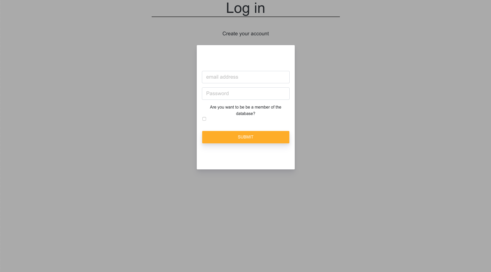

# my-web-app

## my-web-app:
A web page for client to sign up as Student and Worker.
Students will be able to see all the worker and ask for referral.
Workers will be able to see all the student and decide to help student.

## Tech used:
React
MongDB
JS
HTML
CSS
Express
Reactstrap
Heroku

## How to install and use:
```
$ git clone
In the root folder of the App and install all dependencies using npm install
Then run npm start 
```
////YHuangxu: this command only did not start the frontend as well, maybe need to add commands for frontend?
```
cd front
npm install
npm start
```
////


## Link
[web-page](https://secure-earth-49982.herokuapp.com/)

## Screenshots:



## License
Licensed under the [MIT License](LICENSE).
